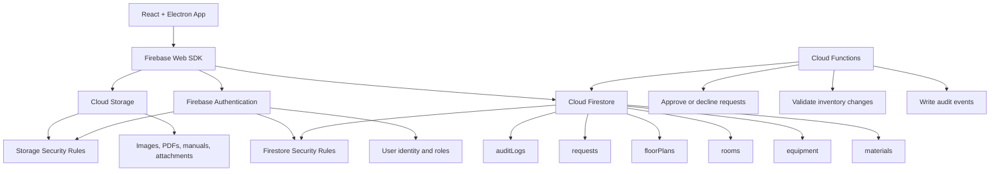

# Firebase Backend Design

Date: 2026-07-05

## Recommendation

Use Firebase as the first backend for Viventory.

Firebase is a good fit for the current application because the product needs a practical inventory backend more than a custom server platform. The app already has local frontend state for materials, equipment, rooms, floor plans, requests, admin views, and user views. Firebase can replace that local state with a shared cloud source of truth without requiring the team to build and operate a separate API server.

Recommended Firebase services:

- Firebase Authentication for user login.
- Cloud Firestore for materials, equipment, rooms, floor plans, and requests.
- Firebase Security Rules for role-based access control.
- Cloud Storage for equipment photos, material images, manuals, and uploaded documents.
- Cloud Functions only for trusted server-side workflows such as approving requests, updating stock, changing roles, and writing audit logs.

Firebase should be preferred over a custom Express/Postgres backend for the first production version unless the team needs complex SQL reporting, strict relational constraints, self-hosting, or advanced backend workflows. Supabase/Postgres is a reasonable alternative if SQL becomes important, but Firebase is faster to integrate and easier for the current team to maintain.

## Architecture



## Data Model

Suggested Firestore collections:

```text
/users/{userId}
  displayName
  email
  role: "admin" | "user"
  createdAt
  updatedAt

/materials/{materialId}
  name
  category
  quantity
  roomId
  compartmentId
  status
  imageUrl
  updatedAt
  updatedBy

/equipment/{equipmentId}
  name
  type
  serialNumber
  roomId
  status
  maintenanceDueAt
  imageUrl
  updatedAt
  updatedBy

/rooms/{roomId}
  name
  floorId
  description
  updatedAt

/floorPlans/{floorId}
  name
  elements
  updatedAt
  updatedBy

/requests/{requestId}
  userId
  itemType: "material" | "equipment"
  itemId
  quantity
  status: "pending" | "approved" | "declined"
  reason
  createdAt
  reviewedBy
  reviewedAt

/auditLogs/{logId}
  actorId
  action
  targetType
  targetId
  before
  after
  createdAt
```

## Access Control

Use Firebase Auth for identity and Firestore Security Rules for permissions.

Recommended role model:

- `user`: can view available materials/equipment and create requests.
- `admin`: can create, edit, delete, approve, and decline inventory records and requests.

Important rule decisions:

- Normal users should not directly update inventory quantities.
- Normal users should only create their own requests and read their own request history.
- Admin users can read and manage all inventory and request records.
- Role changes should not be done directly from the frontend. Use a trusted process, such as Cloud Functions or manual Firebase Console administration.
- Approval should be handled by a Cloud Function if it changes inventory quantity, because the operation must validate stock and update request status atomically.

## Data Flow

Typical user request flow:

1. User signs in with Firebase Auth.
2. App reads materials, equipment, rooms, and floor plans from Firestore.
3. User submits a request document with status `pending`.
4. Admin sees pending requests in the admin view.
5. Admin approves or declines the request.
6. A Cloud Function validates the action.
7. If approved, the function updates inventory quantity and request status.
8. The function writes an audit log entry.
9. Firestore realtime listeners update the user and admin interfaces.

## Cost Notes

Firebase is likely cheap for this application while usage is modest. The main cost driver will be Firestore reads, writes, stored data, and outbound transfer.

Cost controls to include early:

- Avoid listening to very large collections without filters.
- Use pagination for inventory lists.
- Query by room, category, status, or search index instead of loading everything.
- Store large files in Cloud Storage, not Firestore.
- Add billing alerts before enabling the Blaze plan.
- Keep Cloud Functions focused on workflows that truly need trusted backend execution.

## Implementation Plan

Recommended rollout:

1. Create a Firebase project and enable Authentication, Firestore, and Storage.
2. Add Firebase config through Vite environment variables.
3. Create a small Firebase service layer in the React app.
4. Move hardcoded materials/equipment/rooms into Firestore seed data.
5. Replace tab-local inventory state with Firestore-backed data hooks or services.
6. Add request creation from the user view.
7. Add admin approve/decline workflows.
8. Add security rules and test them with the Firebase emulator.
9. Add Cloud Functions for stock-sensitive writes.
10. Add billing alerts and basic usage monitoring.

## Open Questions

- Should the first version require login for every user, or only for admins?
- Do materials and equipment share enough fields to use one `items` collection, or should they stay separate?
- Does the app need offline mode for classroom/workshop environments?
- Should request approval reserve stock immediately or only deduct stock after final pickup?
- Should the team support multiple locations or only one VIVITA site initially?

